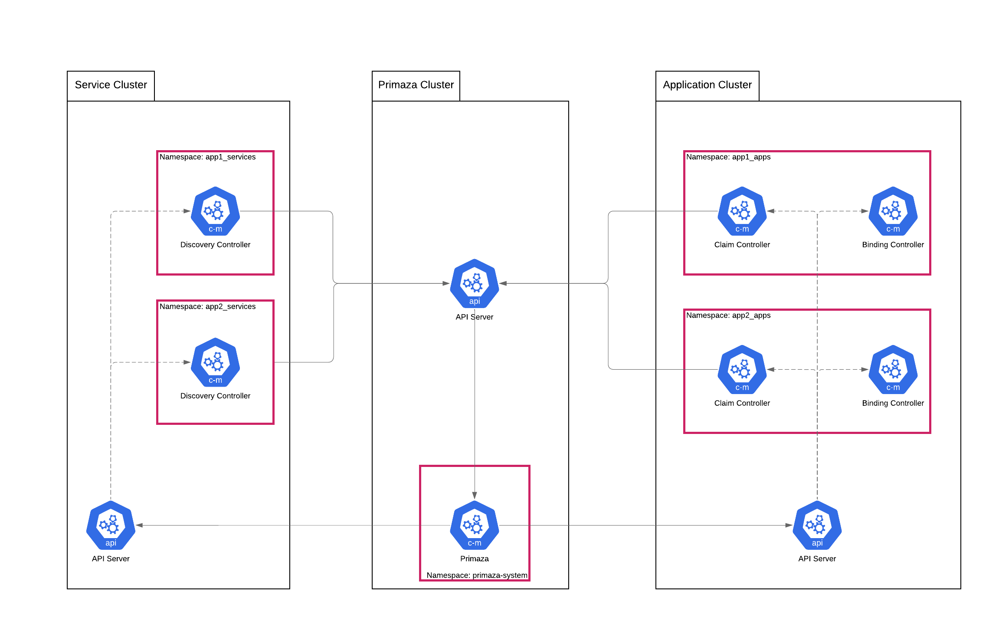

# Index
<!-- vim-markdown-toc GFM -->

* [Agents](#agents)
* [Application agent](#application-agent)
    * [Binding a Service](#binding-a-service)
    * [Claiming a Service](#claiming-a-service)
        * [Claiming from Primaza cluster](#claiming-from-primaza-cluster)
        * [Claiming from Worker cluster](#claiming-from-worker-cluster)

<!-- vim-markdown-toc -->
# Agents

Primaza Agents are pushed into namespaces by Primaza.
Two kinds of Primaza Agents are defined:

* Application agent: is published into application namespaces and binds applications to services.
* Service agent: is published into service namespace and discovers services.

To allow agents to perform operations in the namespace, they need an identity (Service Account) with the right permissions.

[primazactl](https://github.com/primaza/primazactl) is an in-development companion tool to help administrators configuring clusters and namespaces.

# Application agent

Application agents are installed into Cluster Environment's application namespaces.
Namespaces on worker cluster need to be previously configured to allow, agents to run properly.
Application agents just need to access resources in the namespace they are published into.

More specifically, an application agent requires the following resources to exists into the namespace:

* A Role granting
    * full access to `leases.coordination.k8s.io`
    * read access to `servicebindings.primaza.io`
    * read access and update rights for `deployments.apps`
    * create right for `events`
* A Service Account for the agent
* A RoleBinding that binds the ServiceAccount to the Role

## Binding a Service

<!-- TODO: -->

## Claiming a Service

<!-- TODO: -->

### Claiming from Primaza cluster

<!-- TODO: -->

### Claiming from Worker cluster

<!-- TODO: -->

